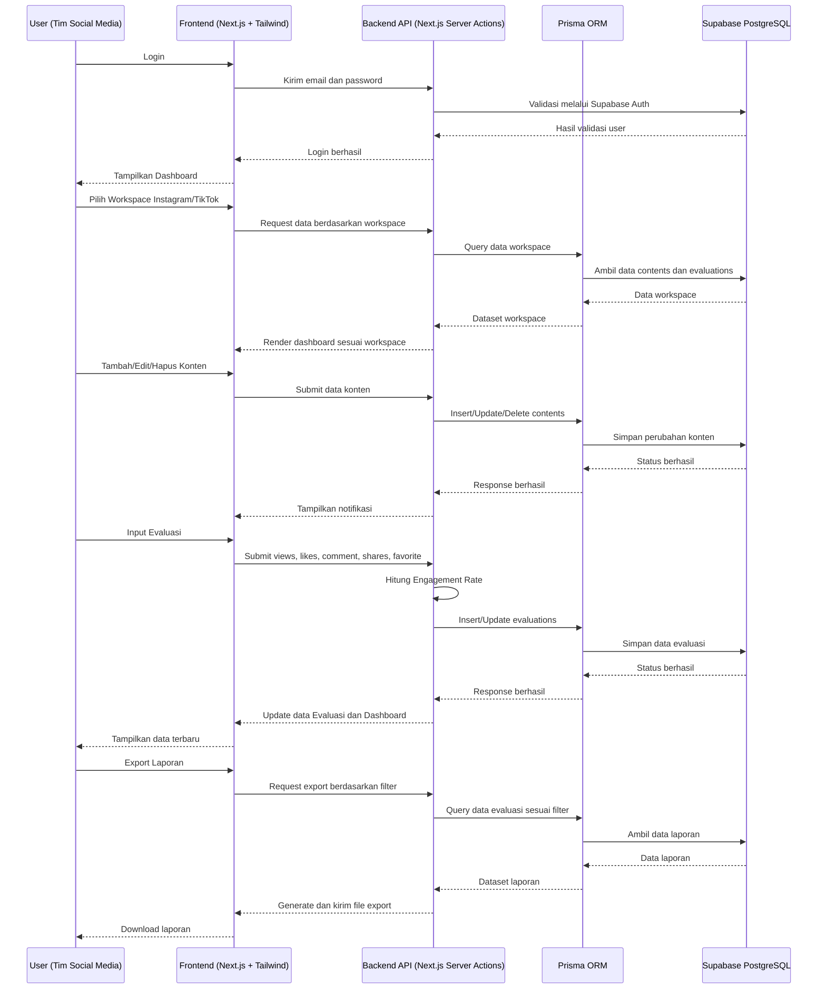
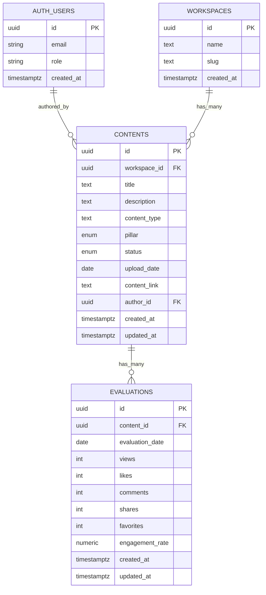

# PRD — Project Requirements Document

# SanggaluriMS

## Dashboard Social Media Management System Berbasis Web untuk Workspace Instagram dan TikTok Sanggaluri Park Purbalingga

---

# 1. Overview

Tim Social Media Specialist di Sanggaluri Park Purbalingga membutuhkan sistem internal yang dapat membantu proses pengelolaan konten media sosial secara lebih terpusat, terjadwal, dan terukur. Saat ini, proses pengelolaan konten Instagram dan TikTok masih berpotensi dilakukan melalui catatan manual, spreadsheet, dan komunikasi grup, sehingga dapat menyebabkan jadwal upload terlewat, ide konten tercecer, serta evaluasi performa konten tidak terdokumentasi secara rapi.

**SanggaluriMS** hadir sebagai solusi berupa dashboard internal berbasis web yang digunakan untuk membantu tim social media specialist dalam mengelola perencanaan konten, jadwal unggah, status konten, dan evaluasi performa konten. Sistem ini dirancang untuk memiliki dua workspace utama, yaitu **Instagram** dan **TikTok**, agar pengelolaan data pada masing-masing platform dapat dipisahkan secara jelas dan tidak tercampur.

Aplikasi ini tidak ditujukan sebagai website publik, melainkan sebagai sistem kerja internal untuk mendukung aktivitas manajemen konten digital Sanggaluri Park. Fokus utama sistem adalah membantu pengguna melihat konten yang harus diunggah, mengelola ide konten berdasarkan pilar marketing, memantau jadwal melalui kalender, mencatat evaluasi performa konten secara manual, serta mengekspor laporan evaluasi.

Tujuan utama SanggaluriMS adalah:

1. Membantu tim melihat konten yang harus diunggah setiap hari.
2. Menyediakan workspace terpisah untuk Instagram dan TikTok.
3. Mengelola ide dan rencana konten berdasarkan pilar marketing.
4. Menampilkan kalender unggah yang terintegrasi dengan data konten.
5. Menampilkan status konten dengan visual yang mudah dipahami.
6. Mencatat evaluasi performa konten secara manual.
7. Menghitung Engagement Rate secara otomatis.
8. Menyediakan fitur export laporan evaluasi.
9. Menyediakan ringkasan performa konten untuk mendukung pengambilan keputusan.

---

# 2. Requirements

## 2.1 Hak Akses Internal

Aplikasi hanya digunakan oleh pengguna internal Sanggaluri Park, khususnya tim social media specialist atau staf marketing yang bertanggung jawab terhadap pengelolaan konten Instagram dan TikTok.

Sistem tidak menyediakan fitur register publik. Akun pengguna hanya dapat dibuat secara manual oleh admin atau developer melalui database atau panel Supabase.

Ketentuan hak akses:

- Pengguna harus login sebelum mengakses sistem.
- Tidak ada fitur pendaftaran akun secara mandiri.
- Akun hanya dapat dibuat oleh admin atau developer.
- Sistem digunakan untuk kebutuhan internal, bukan untuk publik.
- Data hanya dapat dikelola oleh pengguna yang memiliki akses login.

---

## 2.2 Workspace Instagram dan TikTok

Sistem harus memiliki dua workspace utama, yaitu:

1. **Workspace Instagram**
2. **Workspace TikTok**

Setiap workspace memiliki data yang terpisah, meliputi:

- Data konten
- Jadwal kalender
- Content plan
- Data evaluasi
- Ringkasan dashboard
- Laporan evaluasi

Pemisahan workspace ini bertujuan agar konten Instagram dan TikTok tidak tercampur, sehingga pengguna dapat mengelola masing-masing platform dengan lebih terstruktur.

---

## 2.3 Input Evaluasi Manual

SanggaluriMS tidak mengambil data otomatis dari API Instagram atau TikTok. Seluruh data evaluasi konten dimasukkan secara manual oleh staf marketing sosial media atau pengguna.

Data evaluasi yang diinput manual meliputi:

- Views
- Likes
- Comment
- Shares
- Favorite
- Tanggal Evaluasi

Sistem akan membantu menghitung nilai **Engagement Rate (ER)** secara otomatis berdasarkan data interaksi yang dimasukkan.

---

## 2.4 Status Konten

Sistem memiliki empat status konten utama:

| Status         | Keterangan                                                        | Warna Label |
| -------------- | ----------------------------------------------------------------- | ----------- |
| **Uploaded**   | Konten sudah berhasil diunggah ke Instagram atau TikTok           | Hijau/Tosca |
| **Unuploaded** | Konten belum diunggah                                             | Merah/Pink  |
| **Pending**    | Konten masih menunggu proses, persetujuan, atau belum siap upload | Kuning      |
| **Cancelled**  | Konten dibatalkan dan tidak jadi diunggah                         | Abu-abu     |

Catatan:
Istilah yang digunakan dalam database dan PRD adalah **Cancelled**, bukan **Cancel**, agar konsisten dengan legend status.

---

## 2.5 Aplikasi Berbasis Website

Sistem dibuat dalam bentuk website internal yang dapat diakses melalui browser.

Teknologi utama yang digunakan:

- Next.js
- JavaScript
- TypeScript sebagai rekomendasi
- Supabase
- Prisma
- Tailwind CSS
- Lucide-React
- HTML
- CSS
- Hosting sanggaluri.com

---

## 2.6 Orientasi Desktop

Karena SanggaluriMS berfungsi sebagai dashboard manajemen pekerjaan, rancangan antarmuka difokuskan untuk penggunaan pada layar desktop atau laptop.

Tampilan tetap dapat dibuat responsif, tetapi prioritas utama desain adalah kenyamanan penggunaan pada tampilan desktop.

---

# 3. Core Features

SanggaluriMS memiliki empat modul utama:

1. Dashboard
2. Calendar
3. Content Plan
4. Evaluasi

---

# 3.1 Dashboard

Dashboard merupakan halaman utama yang menampilkan ringkasan data konten. Modul ini membantu pengguna melihat kondisi konten harian dan bulanan secara cepat.

---

## 3.1.1 Today's Upload

Fitur **Today's Upload** menampilkan daftar konten yang harus diunggah pada hari ini.

Data yang ditampilkan:

- Nama Konten
- Workspace
- Jenis Konten
- Pillar
- Status Konten
- Tanggal Upload
- Link Konten jika sudah tersedia

Tujuan fitur ini adalah membantu pengguna mengetahui konten apa saja yang harus dipublikasikan pada hari tersebut.

---

## 3.1.2 Best Content Last Month

Fitur **Best Content Last Month** menampilkan konten dengan performa terbaik pada bulan sebelumnya.

Penentuan konten terbaik dapat berdasarkan:

- Views tertinggi
- Likes tertinggi
- Comment tertinggi
- Shares tertinggi
- Favorite tertinggi
- Engagement Rate tertinggi

Secara default, sistem dapat menjadikan **Engagement Rate (ER)** sebagai indikator utama untuk menentukan performa terbaik, tetapi data lain tetap dapat digunakan sebagai bahan perbandingan.

---

## 3.1.3 Metrik Pertumbuhan Views Last Month

Fitur ini menampilkan pertumbuhan jumlah views pada bulan sebelumnya.

Metrik ini digunakan untuk melihat apakah performa konten mengalami:

- Peningkatan
- Penurunan
- Stabil

Data ini membantu tim membaca efektivitas strategi konten pada bulan sebelumnya.

---

## 3.1.4 Total Content Uploaded This Month

Fitur ini menampilkan jumlah total konten yang sudah diunggah pada bulan berjalan.

Data dihitung berdasarkan konten dengan status:

- Uploaded

Tujuan fitur ini adalah membantu pengguna mengetahui progres jumlah konten yang telah dipublikasikan selama bulan berjalan.

---

## 3.1.5 Summary Content

Fitur **Summary Content** menampilkan jumlah konten yang sudah diunggah berdasarkan pilar konten.

Pilar konten terdiri dari:

1. Awareness
2. Consideration
3. Conversion

Contoh tampilan summary:

| Pillar        | Jumlah Konten Uploaded |
| ------------- | ---------------------: |
| Awareness     |                     12 |
| Consideration |                      8 |
| Conversion    |                      5 |

Fitur ini membantu tim melihat apakah distribusi konten pada tiap pilar sudah seimbang atau belum.

---

# 3.2 Calendar

Modul **Calendar** digunakan untuk menampilkan jadwal unggah konten dalam bentuk kalender bulanan.

---

## 3.2.1 Tampilan Kalender Bulan Ini

Sistem menampilkan kalender berdasarkan bulan berjalan secara default.

Pengguna dapat melihat tanggal-tanggal yang memiliki jadwal konten.

---

## 3.2.2 Pilih Bulan Kalender

Pengguna dapat memilih bulan tertentu untuk melihat jadwal konten pada bulan tersebut.

Contoh filter bulan:

- Januari
- Februari
- Maret
- April
- Mei
- Juni
- dan seterusnya

---

## 3.2.3 Integrasi Kalender dengan Data Konten

Kalender terhubung dengan data konten yang tersimpan pada tabel konten. Setiap konten yang memiliki tanggal upload akan tampil pada tanggal terkait di kalender.

Data kalender mengikuti workspace yang sedang dipilih, sehingga jadwal Instagram dan TikTok tidak tercampur.

---

## 3.2.4 Label Warna Kalender

Setiap konten yang tampil pada kalender memiliki label warna berdasarkan status konten:

| Status     | Warna       |
| ---------- | ----------- |
| Uploaded   | Hijau/Tosca |
| Unuploaded | Merah/Pink  |
| Pending    | Kuning      |
| Cancelled  | Abu-abu     |

Ketentuan tampilan:

- Jika konten sudah berhasil diunggah, maka label berwarna hijau/tosca.
- Jika konten belum diunggah, maka label berwarna merah/pink.
- Jika konten masih menunggu proses atau persetujuan, maka label berwarna kuning.
- Jika konten dibatalkan, maka label berwarna abu-abu.
- Jika dalam satu tanggal terdapat beberapa konten dengan status berbeda, sistem dapat menampilkan beberapa label pada tanggal yang sama.

---

## 3.2.5 Detail Konten Berdasarkan Tanggal

Ketika pengguna memilih tanggal tertentu pada kalender, sistem akan menampilkan daftar konten yang harus diunggah atau dijadwalkan pada tanggal tersebut.

Detail konten yang ditampilkan:

- Nama Konten
- Status Konten
- Jenis Konten
- Deskripsi Konten
- Pillar
- Link Konten jika tersedia

Tujuan fitur ini adalah membantu pengguna melihat rincian pekerjaan pada tanggal tertentu tanpa harus membuka tabel konten secara manual.

---

# 3.3 Content Plan

Modul **Content Plan** digunakan untuk mengelola ide dan rencana konten sebelum atau selama proses publikasi.

---

## 3.3.1 Tambah Konten

Pengguna dapat menambahkan konten baru ke dalam sistem.

Data yang diinput:

- Nama Konten
- Workspace
- Deskripsi Konten
- Jenis Konten
- Tanggal Upload
- Pillar
- Status Konten
- Link Konten

---

## 3.3.2 Edit Konten

Pengguna dapat mengubah data konten yang sudah ada.

Data yang dapat diedit:

- Nama Konten
- Deskripsi Konten
- Jenis Konten
- Tanggal Upload
- Pillar
- Status Konten
- Link Konten

---

## 3.3.3 Hapus Konten

Pengguna dapat menghapus data konten yang sudah tidak diperlukan.

Sebelum data dihapus, sistem sebaiknya menampilkan konfirmasi agar pengguna tidak menghapus data secara tidak sengaja.

---

## 3.3.4 Tampilan Kartu Ide Konten

Content Plan menampilkan ide-ide konten dalam bentuk kartu.

Setiap kartu berisi informasi utama:

- Nama Konten
- Deskripsi singkat
- Jenis Konten
- Tanggal Upload
- Status Konten

---

## 3.3.5 Kolom Berdasarkan Pillar

Kartu konten dikelompokkan ke dalam tiga kolom berdasarkan pilar marketing:

1. Awareness
2. Consideration
3. Conversion

Struktur tampilan:

| Awareness    | Consideration | Conversion   |
| ------------ | ------------- | ------------ |
| Kartu Konten | Kartu Konten  | Kartu Konten |

Tujuan pengelompokan ini adalah membantu tim membaca persebaran ide konten berdasarkan tujuan marketing.

---

## 3.3.6 Status pada Content Plan

Setiap kartu konten memiliki status:

- Uploaded
- Unuploaded
- Pending
- Cancelled

Status ini dapat dipilih melalui dropdown pada form tambah atau edit konten.

---

# 3.4 Evaluasi

Modul **Evaluasi** digunakan untuk mencatat, melihat, memfilter, dan mengekspor data performa konten setelah konten diunggah.

Data evaluasi diinput secara manual oleh pengguna berdasarkan data insight dari Instagram atau TikTok.

---

## 3.4.1 Best Content of Month

Fitur **Best Content of Month** menampilkan konten terbaik berdasarkan bulan yang dipilih.

Pengguna dapat memilih bulan tertentu, lalu sistem akan menampilkan konten dengan performa terbaik pada bulan tersebut.

Indikator yang dapat digunakan:

- Views
- Likes
- Comment
- Shares
- Favorite
- Engagement Rate

---

## 3.4.2 Summary Evaluasi

Pada halaman Evaluasi, sistem menampilkan ringkasan berdasarkan bulan atau filter yang dipilih.

Summary yang ditampilkan:

- Jumlah konten Uploaded
- Jumlah konten Unuploaded
- Jumlah konten Pending
- Jumlah konten Cancelled

Data ini diambil dari tabel konten berdasarkan workspace dan periode yang dipilih.

---

## 3.4.3 Tabel Evaluasi

Tabel Evaluasi menampilkan data performa konten.

Kolom tabel:

|  No | Kolom            |
| --: | ---------------- |
|   1 | Nama Konten      |
|   2 | Tanggal Upload   |
|   3 | Tanggal Evaluasi |
|   4 | Views            |
|   5 | Likes            |
|   6 | Comment          |
|   7 | Shares           |
|   8 | Favorite         |
|   9 | ER               |

---

## 3.4.4 Filter Evaluasi

Pengguna dapat memfilter data evaluasi berdasarkan:

- Bulan tertentu
- All
- Last Week
- Jumlah data yang dilihat

Contoh jumlah data yang dilihat:

- 10 data
- 25 data
- 50 data
- 100 data

---

## 3.4.5 CRUD Evaluasi

Tabel Evaluasi dapat dikelola dengan fitur CRUD.

Fitur yang tersedia:

1. Tambah Evaluasi
2. Edit Evaluasi
3. Hapus Evaluasi
4. Lihat Data Evaluasi

---

## 3.4.6 Perhitungan Engagement Rate

Nilai **ER** dihitung otomatis oleh sistem berdasarkan data evaluasi.

Rumus ER:

```text
ER = ((Likes + Comment + Shares + Favorite) / Views) × 100
```

Contoh:

```text
Likes = 100
Comment = 20
Shares = 10
Favorite = 30
Views = 2000

ER = ((100 + 20 + 10 + 30) / 2000) × 100
ER = 8%
```

Jika views bernilai 0, maka sistem harus mencegah pembagian dengan nol dan menampilkan ER sebagai 0%.

---

## 3.4.7 Export Laporan

Fitur **Export Laporan** digunakan untuk mengunduh data evaluasi konten berdasarkan filter yang sedang dipilih.

Data yang dapat diekspor meliputi:

- Nama Konten
- Workspace
- Pillar
- Status Konten
- Tanggal Upload
- Tanggal Evaluasi
- Views
- Likes
- Comment
- Shares
- Favorite
- ER

Format export yang dapat disediakan:

- Excel/XLSX
- CSV
- PDF jika dibutuhkan

Tujuan fitur ini adalah membantu tim membuat laporan performa konten secara lebih cepat tanpa harus menyalin data secara manual dari sistem.

---

# 4. User Flow

## 4.1 Login

Pengguna membuka website SanggaluriMS dan login menggunakan akun yang telah dibuatkan oleh admin atau developer.

Alur:

1. Pengguna membuka halaman login.
2. Pengguna memasukkan email dan password.
3. Sistem melakukan validasi melalui Supabase Auth.
4. Jika login berhasil, pengguna masuk ke dashboard.
5. Jika login gagal, sistem menampilkan pesan error.

---

## 4.2 Pilih Workspace

Setelah login, pengguna memilih workspace yang ingin dikelola.

Pilihan workspace:

- Instagram
- TikTok

Setelah workspace dipilih, seluruh data yang ditampilkan akan mengikuti workspace tersebut.

Data yang terpengaruh oleh workspace:

- Dashboard
- Calendar
- Content Plan
- Evaluasi
- Export laporan

---

## 4.3 Melihat Dashboard

Pengguna masuk ke halaman Dashboard untuk melihat ringkasan utama.

Informasi yang dilihat:

- Today's Upload
- Best Content Last Month
- Metrik Pertumbuhan Views Last Month
- Total Content Uploaded This Month
- Summary Content berdasarkan pilar

---

## 4.4 Mengelola Content Plan

Pengguna membuka halaman Content Plan untuk mengelola ide dan rencana konten.

Alur:

1. Pengguna membuka menu Content Plan.
2. Pengguna memilih tombol Tambah Konten.
3. Pengguna mengisi data konten.
4. Pengguna memilih pillar: Awareness, Consideration, atau Conversion.
5. Pengguna menentukan tanggal upload.
6. Pengguna memilih status: Uploaded, Unuploaded, Pending, atau Cancelled.
7. Pengguna menyimpan data.
8. Konten tampil sebagai kartu sesuai pilar yang dipilih.

---

## 4.5 Melihat Calendar

Pengguna membuka halaman Calendar untuk memantau jadwal upload.

Alur:

1. Pengguna membuka menu Calendar.
2. Sistem menampilkan kalender bulan berjalan.
3. Pengguna dapat memilih bulan lain.
4. Sistem menampilkan label warna pada tanggal yang memiliki konten.
5. Pengguna mengklik tanggal tertentu.
6. Sistem menampilkan detail konten pada tanggal tersebut.

---

## 4.6 Menginput Evaluasi

Setelah konten diunggah, pengguna membuka halaman Evaluasi untuk mencatat performa konten.

Alur:

1. Pengguna membuka menu Evaluasi.
2. Pengguna memilih konten yang ingin dievaluasi.
3. Pengguna menginput data views, likes, comment, shares, dan favorite.
4. Pengguna mengisi tanggal evaluasi.
5. Sistem menghitung ER secara otomatis.
6. Data tersimpan ke tabel evaluasi.
7. Dashboard dan halaman Evaluasi ter-update berdasarkan data terbaru.

---

## 4.7 Export Laporan Evaluasi

Pengguna dapat melakukan export laporan dari halaman Evaluasi.

Alur:

1. Pengguna membuka menu Evaluasi.
2. Pengguna memilih filter data, seperti bulan, all, atau last week.
3. Pengguna memilih jumlah data yang ingin ditampilkan jika diperlukan.
4. Pengguna menekan tombol Export.
5. Sistem menghasilkan file laporan berdasarkan data yang sedang difilter.
6. Pengguna mengunduh laporan.

---

# 5. Architecture

SanggaluriMS menggunakan arsitektur **Client-Server** modern berbasis Next.js. Frontend dan backend berada dalam satu ekosistem framework, sedangkan data disimpan pada Supabase PostgreSQL. Prisma digunakan sebagai ORM untuk menghubungkan aplikasi dengan database secara lebih terstruktur.

---

## 5.1 Komponen Sistem

### 1. User

User adalah pengguna internal Sanggaluri Park, terutama tim social media specialist atau staf marketing.

### 2. Frontend

Frontend dibangun menggunakan:

- Next.js
- Tailwind CSS
- Lucide-React
- HTML
- CSS

Frontend bertugas menampilkan halaman:

- Login
- Dashboard
- Calendar
- Content Plan
- Evaluasi

### 3. Backend API

Backend menggunakan fitur Next.js, seperti:

- Server Actions
- API Routes jika diperlukan

Backend bertugas menangani:

- Login dan autentikasi
- Query data konten
- Query data evaluasi
- CRUD konten
- CRUD evaluasi
- Perhitungan ER
- Filter data berdasarkan workspace dan bulan
- Export laporan

### 4. Database

Database menggunakan Supabase PostgreSQL.

Data utama yang disimpan:

- User
- Workspace
- Konten
- Evaluasi

### 5. ORM

Prisma digunakan sebagai ORM untuk mengelola relasi database dan query dari aplikasi Next.js ke Supabase PostgreSQL.

### 6. Hosting

Aplikasi akan di-deploy menggunakan **hosting sanggaluri.com**.

---

## 5.2 Sequence Diagram



---

# 6. Database Schema

Skema database dirancang untuk mendukung pemisahan workspace, pengelolaan konten, kalender, evaluasi performa, dan export laporan.

Entitas utama:

1. Auth Users
2. Workspaces
3. Contents
4. Evaluations

---

## 6.1 Auth Users

Menggunakan tabel bawaan Supabase Auth.

Fungsi:

- Menyimpan data autentikasi pengguna.
- Menjadi referensi user yang membuat atau mengelola data.

Kolom utama:

| Kolom      | Tipe Data   | Keterangan                     |
| ---------- | ----------- | ------------------------------ |
| id         | uuid        | Primary key dari Supabase Auth |
| email      | text        | Email pengguna                 |
| role       | text        | Role pengguna                  |
| created_at | timestamptz | Waktu akun dibuat              |

Catatan:

- Tidak ada fitur register publik.
- User dibuat manual oleh admin atau developer.

---

## 6.2 Workspaces

Tabel Workspaces digunakan untuk menyimpan data workspace Instagram dan TikTok.

| Kolom      | Tipe Data   | Keterangan                              |
| ---------- | ----------- | --------------------------------------- |
| id         | uuid        | Primary key                             |
| name       | text        | Nama workspace, contoh Instagram/TikTok |
| slug       | text        | Slug workspace, contoh instagram/tiktok |
| created_at | timestamptz | Waktu data dibuat                       |

Contoh data:

| name      | slug      |
| --------- | --------- |
| Instagram | instagram |
| TikTok    | tiktok    |

---

## 6.3 Contents

Tabel Contents digunakan untuk menyimpan data rencana konten.

| Kolom        | Tipe Data   | Keterangan                               |
| ------------ | ----------- | ---------------------------------------- |
| id           | uuid        | Primary key                              |
| workspace_id | uuid        | Relasi ke tabel Workspaces               |
| title        | text        | Nama konten                              |
| description  | text        | Deskripsi konten                         |
| content_type | text        | Jenis konten                             |
| pillar       | enum        | Awareness, Consideration, Conversion     |
| status       | enum        | Uploaded, Unuploaded, Pending, Cancelled |
| upload_date  | date        | Tanggal upload                           |
| content_link | text        | Link konten setelah diunggah             |
| author_id    | uuid        | Relasi ke Supabase Auth user             |
| created_at   | timestamptz | Waktu data dibuat                        |
| updated_at   | timestamptz | Waktu data diperbarui                    |

Enum pillar:

```text
awareness
consideration
conversion
```

Enum status:

```text
uploaded
unuploaded
pending
cancelled
```

Contoh content_type:

```text
Reels
Feed
Story
TikTok Video
Carousel
Short Video
```

---

## 6.4 Evaluations

Tabel Evaluations digunakan untuk menyimpan data performa konten.

| Kolom           | Tipe Data   | Keterangan               |
| --------------- | ----------- | ------------------------ |
| id              | uuid        | Primary key              |
| content_id      | uuid        | Relasi ke tabel Contents |
| evaluation_date | date        | Tanggal evaluasi         |
| views           | integer     | Total views              |
| likes           | integer     | Total likes              |
| comments        | integer     | Total comment            |
| shares          | integer     | Total shares             |
| favorites       | integer     | Total favorite           |
| engagement_rate | numeric     | Nilai ER                 |
| created_at      | timestamptz | Waktu data dibuat        |
| updated_at      | timestamptz | Waktu data diperbarui    |

Catatan:

- Tanggal upload tidak perlu disimpan ulang di tabel Evaluations karena dapat diambil dari tabel Contents melalui relasi `content_id`.
- ER dihitung otomatis oleh sistem saat data evaluasi ditambahkan atau diperbarui.
- Data pada tabel Evaluations menjadi sumber utama untuk fitur Best Content dan Export Laporan.

---

## 6.5 ER Diagram



---

## 6.6 Database Index

Untuk mempercepat query, sistem perlu menambahkan index pada kolom berikut:

```sql
contents(workspace_id)
contents(upload_date)
contents(status)
contents(pillar)
evaluations(content_id)
evaluations(evaluation_date)
```

Tujuan index:

- Mempercepat filter berdasarkan workspace.
- Mempercepat tampilan kalender berdasarkan tanggal upload.
- Mempercepat filter evaluasi berdasarkan bulan.
- Mempercepat join antara konten dan evaluasi.
- Mempercepat proses export laporan berdasarkan periode tertentu.

---

# 7. Tech Stack

Pilihan teknologi dititikberatkan pada pengembangan yang cepat, antarmuka modern yang rapi untuk kebutuhan dashboard management, serta kemudahan pengelolaan database dan autentikasi pengguna internal.

---

## 7.1 Frontend & Full-stack Framework

**Next.js**

Next.js digunakan sebagai framework utama untuk membangun aplikasi website SanggaluriMS. Framework ini mendukung pengembangan frontend dan backend dalam satu ekosistem sehingga cocok untuk membangun dashboard internal yang membutuhkan pengelolaan data, autentikasi, dan tampilan antarmuka.

Next.js juga mendukung penggunaan Server Actions agar proses pengiriman data dari form ke database dapat dilakukan secara lebih sederhana dan terstruktur.

---

## 7.2 Bahasa Pemrograman

**JavaScript**

JavaScript digunakan sebagai bahasa pemrograman utama dalam pengembangan aplikasi.

Selain itu, penggunaan **TypeScript sangat disarankan**, terutama karena sistem menggunakan Prisma. TypeScript dapat membantu menjaga struktur data agar lebih aman, konsisten, dan mudah dirawat.

---

## 7.3 Styling / Desain Visual UI

**Tailwind CSS**

Tailwind CSS digunakan untuk membangun tampilan antarmuka secara cepat, konsisten, dan fleksibel. Tailwind membantu proses styling komponen dashboard seperti:

- Kartu ringkasan
- Kalender
- Tabel evaluasi
- Tombol aksi
- Layout content plan
- Form input
- Dropdown status
- Komponen export laporan

**Lucide-React**

Lucide-React digunakan sebagai pustaka ikon untuk memperjelas elemen visual pada dashboard, seperti ikon:

- Calendar
- Upload
- Edit
- Delete
- Filter
- Chart
- Search
- Workspace
- Export/Download

---

## 7.4 Database & Authentication

**Supabase**

Supabase digunakan sebagai layanan utama untuk database dan autentikasi pengguna.

Database yang digunakan adalah PostgreSQL yang dikelola oleh Supabase.

Supabase juga digunakan untuk sistem login melalui Supabase Auth. Karena aplikasi bersifat internal, tidak tersedia fitur register publik. Akun pengguna hanya dibuat secara manual oleh admin atau developer melalui database atau panel Supabase.

---

## 7.5 ORM

**Prisma**

Prisma digunakan sebagai ORM untuk menghubungkan aplikasi Next.js dengan database Supabase PostgreSQL.

Prisma membantu developer dalam:

- Mengelola model database
- Mengelola relasi tabel
- Menjalankan query database
- Menjaga struktur database agar lebih mudah dibaca
- Mengurangi risiko query yang tidak terstruktur

---

## 7.6 Hosting / Deployment

**Hosting sanggaluri.com**

Aplikasi SanggaluriMS akan di-deploy menggunakan hosting milik **sanggaluri.com**.

Dengan penggunaan hosting ini, aplikasi dapat dikelola pada lingkungan domain dan infrastruktur yang digunakan oleh pihak Sanggaluri Park. Sistem tetap bersifat internal dan hanya dapat digunakan oleh pengguna yang memiliki akun login.

---

# 8. Batasan Masalah

Batasan masalah pada pengembangan SanggaluriMS adalah sebagai berikut:

1. Sistem hanya dibuat sebagai aplikasi berbasis website.
2. Sistem hanya digunakan untuk kebutuhan workspace social media specialist pada Instagram dan TikTok.
3. Sistem tidak digunakan untuk pengawasan aplikasi lain di luar Instagram dan TikTok.
4. Sistem tidak memiliki fitur register publik.
5. Seluruh data user hanya dapat ditambahkan secara manual oleh admin atau developer melalui database atau panel Supabase.
6. Input evaluasi hanya dilakukan secara manual oleh staf marketing sosial media atau pengguna.
7. Sistem belum memiliki integrasi otomatis dengan API Instagram atau TikTok.
8. Sistem belum memiliki fitur auto-posting.
9. Sistem belum memiliki fitur chatbot atau AI.
10. Sistem difokuskan untuk kebutuhan dashboard internal, bukan website profil publik.
11. Export laporan hanya dilakukan berdasarkan data yang tersedia di dalam sistem, bukan data otomatis dari platform media sosial.

---

# 9. Functional Requirements

## 9.1 Authentication

| Kode   | Requirement                                              |
| ------ | -------------------------------------------------------- |
| FR-001 | Sistem harus menyediakan halaman login.                  |
| FR-002 | Sistem harus memvalidasi user menggunakan Supabase Auth. |
| FR-003 | Sistem tidak menyediakan fitur register publik.          |
| FR-004 | Sistem hanya dapat diakses oleh user yang sudah login.   |

---

## 9.2 Workspace

| Kode   | Requirement                                                        |
| ------ | ------------------------------------------------------------------ |
| FR-005 | Sistem harus menyediakan workspace Instagram dan TikTok.           |
| FR-006 | Sistem harus dapat memfilter data berdasarkan workspace aktif.     |
| FR-007 | Sistem harus memastikan data Instagram dan TikTok tidak tercampur. |

---

## 9.3 Dashboard

| Kode   | Requirement                                                   |
| ------ | ------------------------------------------------------------- |
| FR-008 | Sistem harus menampilkan Today's Upload.                      |
| FR-009 | Sistem harus menampilkan Best Content Last Month.             |
| FR-010 | Sistem harus menampilkan Metrik Pertumbuhan Views Last Month. |
| FR-011 | Sistem harus menampilkan Total Content Uploaded This Month.   |
| FR-012 | Sistem harus menampilkan Summary Content berdasarkan pilar.   |

---

## 9.4 Calendar

| Kode   | Requirement                                                      |
| ------ | ---------------------------------------------------------------- |
| FR-013 | Sistem harus menampilkan kalender bulan berjalan.                |
| FR-014 | Sistem harus menyediakan pilihan bulan.                          |
| FR-015 | Sistem harus menampilkan konten pada tanggal sesuai upload_date. |
| FR-016 | Sistem harus menampilkan label status Uploaded pada kalender.    |
| FR-017 | Sistem harus menampilkan label status Unuploaded pada kalender.  |
| FR-018 | Sistem harus menampilkan label status Pending pada kalender.     |
| FR-019 | Sistem harus menampilkan label status Cancelled pada kalender.   |
| FR-020 | Sistem harus menampilkan detail konten ketika tanggal dipilih.   |

---

## 9.5 Content Plan

| Kode   | Requirement                                                                                            |
| ------ | ------------------------------------------------------------------------------------------------------ |
| FR-021 | Sistem harus menyediakan fitur tambah konten.                                                          |
| FR-022 | Sistem harus menyediakan fitur edit konten.                                                            |
| FR-023 | Sistem harus menyediakan fitur hapus konten.                                                           |
| FR-024 | Sistem harus menampilkan konten dalam bentuk kartu.                                                    |
| FR-025 | Sistem harus mengelompokkan kartu berdasarkan pilar Awareness, Consideration, dan Conversion.          |
| FR-026 | Sistem harus menyediakan pilihan status Uploaded, Unuploaded, Pending, dan Cancelled pada form konten. |

---

## 9.6 Evaluasi

| Kode   | Requirement                                                                                  |
| ------ | -------------------------------------------------------------------------------------------- |
| FR-027 | Sistem harus menyediakan tabel evaluasi.                                                     |
| FR-028 | Sistem harus menyediakan fitur tambah evaluasi.                                              |
| FR-029 | Sistem harus menyediakan fitur edit evaluasi.                                                |
| FR-030 | Sistem harus menyediakan fitur hapus evaluasi.                                               |
| FR-031 | Sistem harus menampilkan Best Content of Month berdasarkan bulan yang dipilih.               |
| FR-032 | Sistem harus menampilkan summary jumlah konten Uploaded, Unuploaded, Pending, dan Cancelled. |
| FR-033 | Sistem harus menyediakan filter bulan, all, last week, dan jumlah data.                      |
| FR-034 | Sistem harus menghitung ER secara otomatis.                                                  |
| FR-035 | Sistem harus menyediakan fitur Export Laporan pada modul Evaluasi.                           |
| FR-036 | Sistem harus dapat mengekspor data evaluasi berdasarkan filter yang dipilih.                 |

---

# 10. Non-Functional Requirements

| Kode    | Requirement                                                                                   |
| ------- | --------------------------------------------------------------------------------------------- |
| NFR-001 | Sistem harus dapat diakses melalui browser.                                                   |
| NFR-002 | Sistem difokuskan untuk tampilan desktop.                                                     |
| NFR-003 | Sistem harus memiliki UI yang sederhana dan mudah dipahami.                                   |
| NFR-004 | Sistem harus memisahkan data berdasarkan workspace.                                           |
| NFR-005 | Sistem harus menjaga data agar hanya dapat diakses oleh user yang login.                      |
| NFR-006 | Sistem harus menyimpan data pada Supabase PostgreSQL.                                         |
| NFR-007 | Sistem harus dapat melakukan operasi CRUD dengan respons yang wajar.                          |
| NFR-008 | Sistem harus dapat di-host pada hosting sanggaluri.com.                                       |
| NFR-009 | Sistem harus dapat menghasilkan export laporan berdasarkan filter data yang dipilih pengguna. |
| NFR-010 | Sistem harus mencegah error pembagian nol pada perhitungan ER.                                |

---

# 11. Future Development

Fitur yang dapat dikembangkan pada tahap berikutnya:

1. Integrasi otomatis dengan API Instagram dan TikTok.
2. Auto-posting konten ke media sosial.
3. Role management yang lebih detail.
4. Notifikasi jadwal upload.
5. Media Library untuk penyimpanan aset foto dan video.
6. Analitik performa konten yang lebih mendalam.
7. Integrasi chatbot atau AI untuk rekomendasi ide konten.

Catatan:
**Export laporan tidak dimasukkan ke Future Development**, karena sudah menjadi fitur utama pada modul Evaluasi.

---

# 12. Success Metrics

Keberhasilan pengembangan SanggaluriMS dapat diukur melalui indikator berikut:

| Indikator                                                                | Target              |
| ------------------------------------------------------------------------ | ------------------- |
| Workspace Instagram dan TikTok tersedia                                  | Berhasil dibuat     |
| Dashboard menampilkan ringkasan data                                     | Berhasil dibuat     |
| Today's Upload tampil berdasarkan tanggal hari ini                       | Berhasil dibuat     |
| Best Content Last Month tampil berdasarkan data evaluasi                 | Berhasil dibuat     |
| Calendar terhubung dengan data konten                                    | Berhasil dibuat     |
| Status Uploaded, Unuploaded, Pending, dan Cancelled tampil pada kalender | Berhasil dibuat     |
| Content Plan dapat melakukan CRUD konten                                 | Berhasil dibuat     |
| Content Plan menampilkan kartu berdasarkan pilar                         | Berhasil dibuat     |
| Evaluasi dapat melakukan CRUD data performa                              | Berhasil dibuat     |
| ER dihitung otomatis                                                     | Berhasil dibuat     |
| Export laporan tersedia pada modul Evaluasi                              | Berhasil dibuat     |
| Data user tidak bisa register mandiri                                    | Berhasil diterapkan |
| Data evaluasi diinput manual                                             | Berhasil diterapkan |
| Sistem dapat diakses melalui hosting sanggaluri.com                      | Berhasil di-deploy  |

---

# 13. Kesimpulan

SanggaluriMS merupakan dashboard internal berbasis web yang dirancang untuk membantu tim social media specialist Sanggaluri Park Purbalingga dalam mengelola konten Instagram dan TikTok secara lebih terstruktur.

Sistem ini memiliki empat modul utama, yaitu **Dashboard**, **Calendar**, **Content Plan**, dan **Evaluasi**. Dashboard digunakan untuk melihat ringkasan konten harian dan bulanan. Calendar digunakan untuk memantau jadwal upload dengan status visual Uploaded, Unuploaded, Pending, dan Cancelled. Content Plan digunakan untuk mengelola ide konten berdasarkan pilar Awareness, Consideration, dan Conversion. Evaluasi digunakan untuk mencatat performa konten secara manual, menghitung Engagement Rate secara otomatis, dan mengekspor laporan evaluasi berdasarkan filter yang dipilih.

Dengan adanya SanggaluriMS, proses pengelolaan konten media sosial diharapkan menjadi lebih rapi, terpusat, mudah dipantau, dan lebih mendukung pengambilan keputusan berbasis data.
